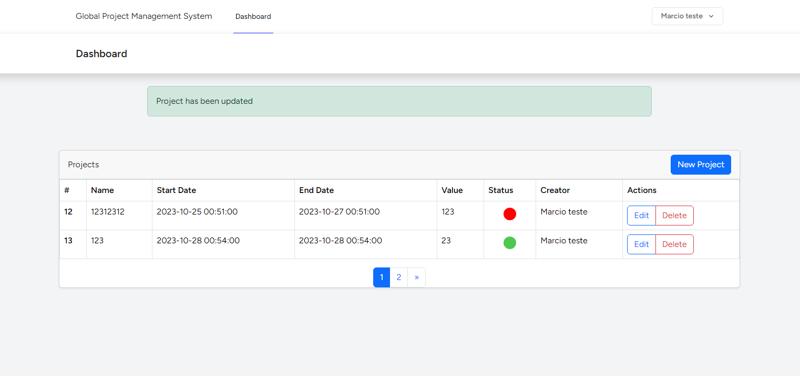

<h1 align="center"> Global Project Management System / CRUD Laravel VUE </h1>

  <a href="#-technologies">Technologies</a>&nbsp;&nbsp;&nbsp;|&nbsp;&nbsp;&nbsp;
  <a href="#-project">Project</a>&nbsp;&nbsp;&nbsp;|&nbsp;&nbsp;&nbsp;
  <a href="#-layout">Layout</a>&nbsp;&nbsp;&nbsp;|&nbsp;&nbsp;&nbsp;

  

 

  

## 🚀 Technologies

This project was developed using the following technologies:

-   [Vue 3 - Options](https://vuejs.org/)
-   [Laravel 10x](https://laravel.com/docs/10.x)
-   [Axios](https://axios-http.com/)
-   [Bootstrap](https://getbootstrap.com/)
-   [InertiaJS](https://inertiajs.com/)

## 💻 Project

1. Vue Componentization
2. CRUD/Pagination with Laravel
3. Use responsiveness and GRID with BS

## Installation:

1. Clone the repository
2. npm install && composer install
3. cp .env.example .env
4. Configure your database in .env
5. Generete the key - php artisan key:generate
6. Run migrations - php artisan migrate
7. Run Users Seeders - php artisan db:seed
8. serve back-end - php artisan serve
9. serve front-end - npm run dev

## Observations:

1.  Some pages contain Tailwind CSS, as they were generated by the Laravel Starter Kit (https://laravel.com/docs/10.x/starter-kits)
2.  The main Files on front-end are Dashboard.vue and Components/TableComponent.vue
3.  On Back-End: Project Model, Project Controller, the last migration (create_projects_table) and some routes on web.php
